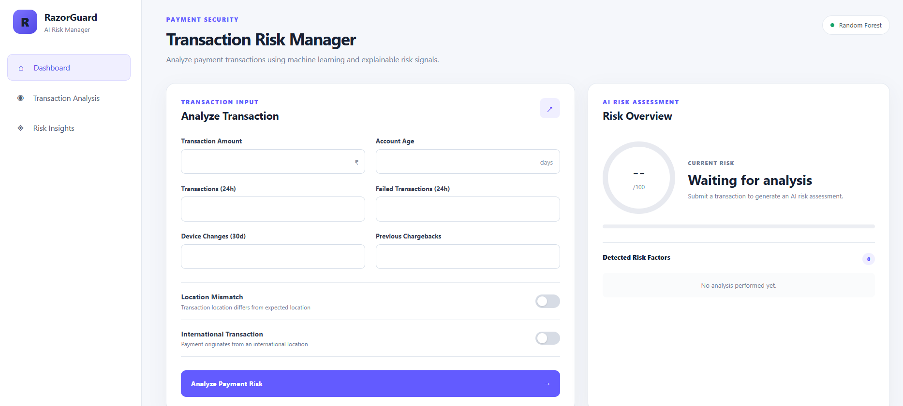
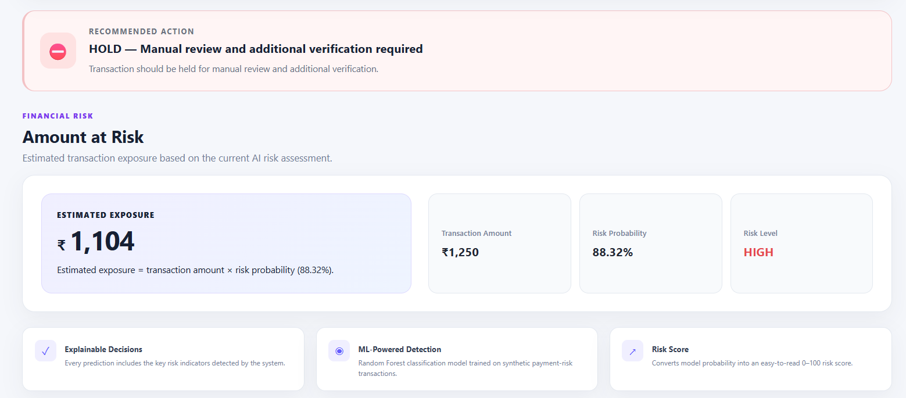
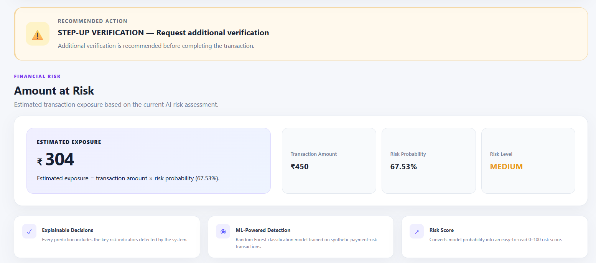
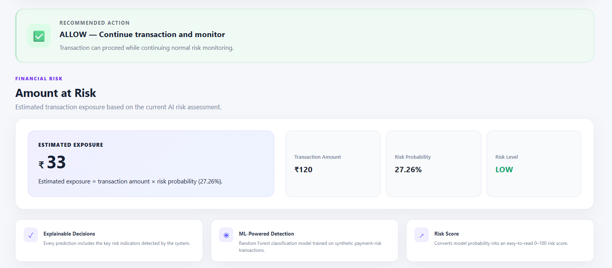
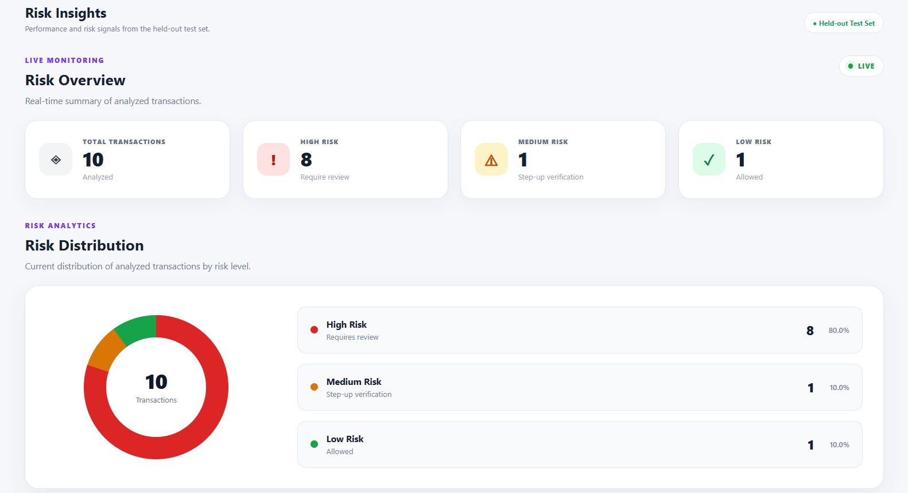
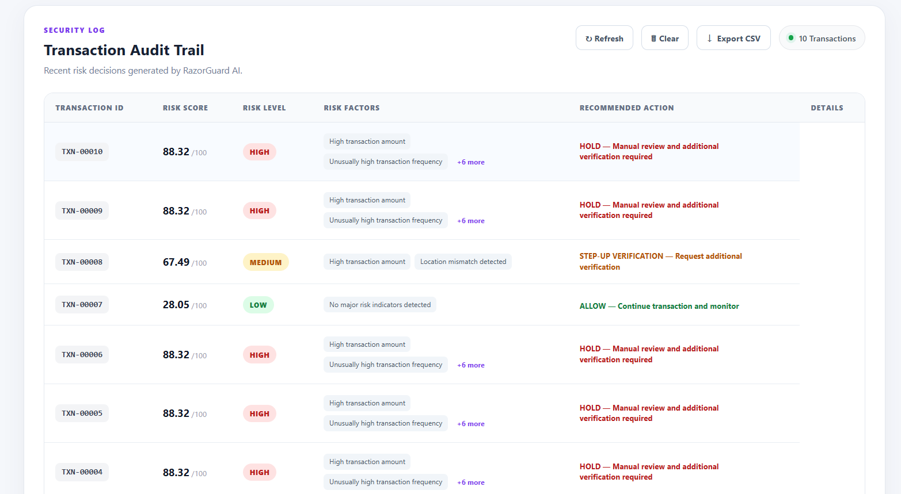

🛡️ RazorGuard AI — Intelligent Payment Risk Manager

A defense-focused AI payment risk management prototype that analyzes transaction signals, estimates risk, explains detected risk factors, and recommends an appropriate defensive action.

Built for the Razorpay AI Buildathon 2026 — Track 2: AI Risk Manager.

🚀 Overview

RazorGuard AI is an intelligent payment risk management prototype designed to identify potentially risky transactions using behavioral and contextual transaction signals.

The system combines a Random Forest machine learning model with an explainable rule layer to:

Analyze transaction risk

Generate a risk probability score

Classify transactions as LOW, MEDIUM, or HIGH risk

Explain detected risk signals

Estimate the amount at risk

Recommend a defensive action

Maintain a transaction audit trail

Provide model performance and risk analytics

Prototype note: This project uses a synthetic transaction dataset and is intended for demonstration and experimentation, not production fraud detection.

✨ Key Features

🤖 AI Risk Detection

Random Forest-based transaction risk prediction.

📊 Risk Scoring

Each transaction receives a risk score, probability, risk level, and detected risk signals.

🔍 Explainable Risk Signals

The application surfaces signals such as:

Previous chargebacks

Location mismatch

Transaction amount

Account age

Device changes

Transaction frequency

Failed transactions

International activity

🛡️ Automated Defensive Actions

Risk Level

Recommended Action

🟢 LOW

Allow transaction and continue monitoring

🟡 MEDIUM

Step-up verification

🔴 HIGH

Hold for manual review and additional verification

📈 Risk Analytics

Risk distribution

Risk activity trend

Model performance

Confusion matrix

False-positive rate

Top risk signals

False-positive cost simulation

Transaction audit trail

🏗️ System Architecture

Transaction Input
       │
       ▼
   Flask REST API
       │
       ▼
    Risk Engine
       │
       ├── Feature Processing
       ├── ML Prediction
       ├── Risk Scoring
       └── Risk Explanation
       │
       ▼
 Random Forest Model
       │
       ▼
 LOW / MEDIUM / HIGH
       │
       ▼
Allow / Verify / Hold

🧠 Machine Learning Model

RazorGuard AI uses a Random Forest Classifier trained on a synthetic dataset containing 10,000 transaction records.

Model Configuration

Algorithm: Random Forest Classifier
Estimators: 400
Maximum Depth: 10
Minimum Samples Split: 8
Minimum Samples Leaf: 3
Class Weight: Balanced
Max Features: sqrt
Random State: 42

Features

amount
account_age_days
transactions_24h
failed_transactions_24h
device_changes_30d
location_mismatch
international_transaction
previous_chargebacks

Target:

is_risky

📊 Model Evaluation

The improved model uses a 60% training / 20% validation / 20% untouched test split.

The validation set was used for decision-threshold tuning, while final metrics were measured on the untouched test set.

Final Held-Out Test Performance

Metric

Score

Accuracy

78.80%

Precision

36.65%

Recall

63.45%

F1 Score

46.46%

False Positive Rate

18.60%

Decision Threshold

0.52

Confusion Matrix

                 Predicted
              Not Risky   Risky

Actual
Not Risky       1392       318
Risky            106       184

Metrics are based on the project's synthetic dataset and held-out test split. They should not be interpreted as real-world or production fraud-detection performance.

🔎 Top Risk Signals

Feature

Importance

Previous Chargebacks

0.3382

Location Mismatch

0.1633

Transaction Amount

0.1269

Account Age

0.1115

Device Changes

0.0963

Transactions in 24h

0.0631

Failed Transactions

0.0614

International Transaction

0.0392

🛡️ Risk Decision Flow

Transaction
     │
     ▼
Feature Analysis
     │
     ▼
ML Risk Probability
     │
     ▼
Risk Score
     │
     ├── < 40 ───────► LOW
     │                   │
     │                   ▼
     │                 ALLOW
     │
     ├── 40–69 ──────► MEDIUM
     │                   │
     │                   ▼
     │          STEP-UP VERIFICATION
     │
     └── ≥ 70 ───────► HIGH
                         │
                         ▼
                  MANUAL REVIEW

🖥️ Product Screenshots

Dashboard

  

🔴 High-Risk Detection

  

🟡 Medium-Risk Action

  

🟢 Low-Risk Action

  

📊 Risk Insights & Analytics

  

🧾 Transaction Audit Trail

  

🔌 API Endpoints

The backend is implemented using Flask.

Method

Endpoint

Purpose

GET

/

Application landing / health response

GET

/api/health

Backend health check

GET

/api/metrics

Model performance metrics

POST

/api/analyze

Analyze a transaction

GET

/api/audit

Retrieve audit records

DELETE

/api/audit

Clear audit records

Example Request

{
  "amount": 1250,
  "account_age_days": 12,
  "transactions_24h": 15,
  "failed_transactions_24h": 4,
  "device_changes_30d": 3,
  "location_mismatch": 1,
  "international_transaction": 1,
  "previous_chargebacks": 1
}

Example Result

Risk Level: HIGH
Risk Score: ~88
Action: HOLD

🧪 Example Risk Scenarios

🔴 HIGH Risk

Multiple elevated-risk signals can result in a HIGH risk classification.

HOLD — Manual review and additional verification required

🟡 MEDIUM Risk

Moderate risk signals can trigger:

STEP-UP VERIFICATION

🟢 LOW Risk

Lower-risk transactions can continue with:

ALLOW — Continue transaction and monitor

📁 Project Structure

RazorGuard-AI/
│
├── app/
│   ├── app.py
│   ├── static/
│   │   ├── script.js
│   │   └── style.css
│   └── templates/
│       └── index.html
│
├── assets/
│   └── screenshots/
│       ├── dashboard.png
│       ├── high-risk-detection.png
│       ├── medium-risk-action.png
│       ├── low-risk-action.png
│       ├── risk-insights-analytics.png
│       └── transaction-audit-trail.png
│
├── data/
│   ├── generate_dataset.py
│   └── transactions.csv
│
├── models/
│   ├── razorguard_model.joblib
│   └── razorguard_improved_model.joblib
│
├── src/
│   ├── train_model.py
│   ├── improve_model.py
│   ├── evaluate_model.py
│   └── risk_engine.py
│
├── .gitignore
├── requirements.txt
└── README.md

⚙️ Tech Stack

Backend: Python, Flask, Flask-CORS

Machine Learning: Scikit-learn, Random Forest, NumPy, Pandas, Joblib

Frontend: HTML5, CSS3, JavaScript

Development: Git, GitHub, Python Virtual Environment

🚀 Getting Started

1. Clone the Repository

git clone https://github.com/Ashutosh9-pan/RazorGuard-AI.git
cd RazorGuard-AI

2. Create a Virtual Environment

Windows

python -m venv venv
.\venv\Scripts\activate

3. Install Dependencies

pip install -r requirements.txt

4. Run the Application

python app\app.py

Open:

http://127.0.0.1:5000

🧪 Model Training

Generate the synthetic dataset:

python data\generate_dataset.py

Train the baseline model:

python src\train_model.py

Train the improved model:

python src\improve_model.py

Evaluate the model:

python src\evaluate_model.py

💰 False-Positive Awareness

Payment risk systems need to balance security with customer experience.

A model that flags too many legitimate transactions can create unnecessary friction, while a model that misses risky transactions can increase exposure.

RazorGuard AI therefore exposes:

Precision

Recall

F1 Score

False Positive Rate

Confusion Matrix

Decision Threshold

False-Positive Cost Simulation

⚠️ Limitations

This project is a prototype:

The dataset is synthetic.

The model has not been validated on real payment data.

Real-world risk patterns can change over time.

Risk rules are prototype heuristics.

The audit trail is currently maintained in application memory.

The model should not be considered production-ready fraud detection.

A production implementation would require additional validation, monitoring, privacy controls, security hardening, model governance, and evaluation on representative real-world data.

🔮 Future Improvements

Real-time event streaming

Persistent transaction storage

Model monitoring and drift detection

Automated threshold optimization

Advanced anomaly detection

Ensemble risk models

Explainable AI techniques

Authentication and role-based access

Production-grade observability

Human-review feedback loops

Integration with payment processing systems

🎯 Buildathon Objective

RazorGuard AI was developed for:

Razorpay AI Buildathon 2026 — Track 2: AI Risk Manager

The project demonstrates a working AI-assisted risk management workflow:

Detect → Explain → Score → Decide → Respond

with measurable model performance and transparent limitations.

👨‍💻 Author

Ashutosh Panwar

B.Tech CSE Graduate
AI/ML Developer | Data Analyst | Android Developer

GitHub: Ashutosh9-pan

Portfolio: ashutosh-panwar-portfolio.vercel.app

⭐ Project Summary

RazorGuard AI demonstrates how machine learning, explainable risk signals, and automated defensive actions can be combined into a single payment risk management workflow.

Transaction
     ↓
AI Risk Analysis
     ↓
Explainable Signals
     ↓
Risk Classification
     ↓
Defensive Action
     ↓
Audit & Analytics

Built as a prototype for the Razorpay AI Buildathon 2026.